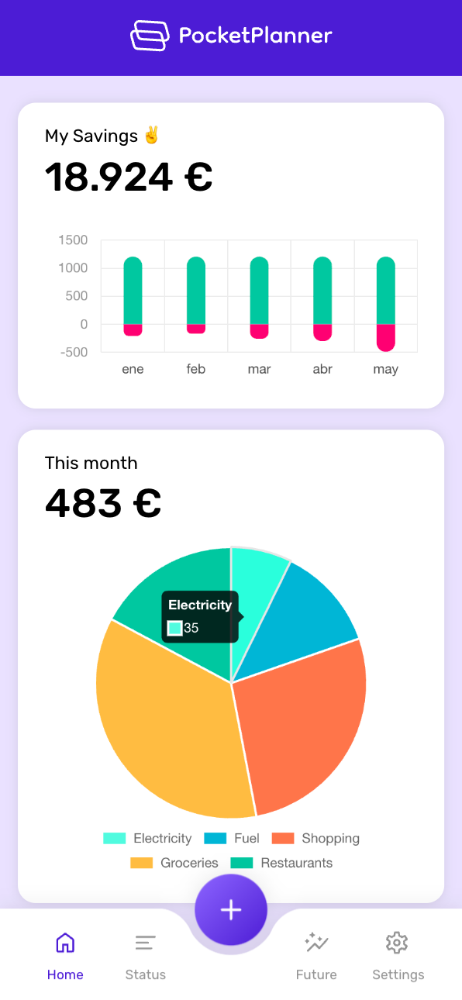
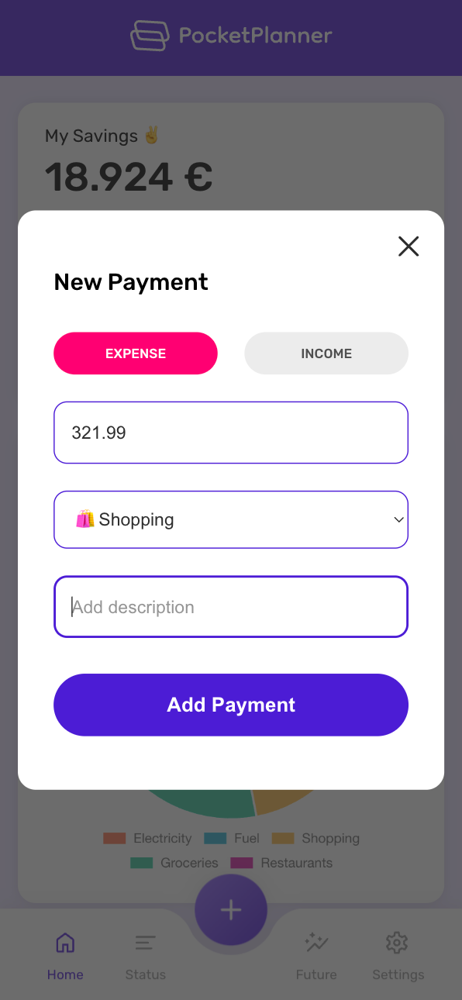
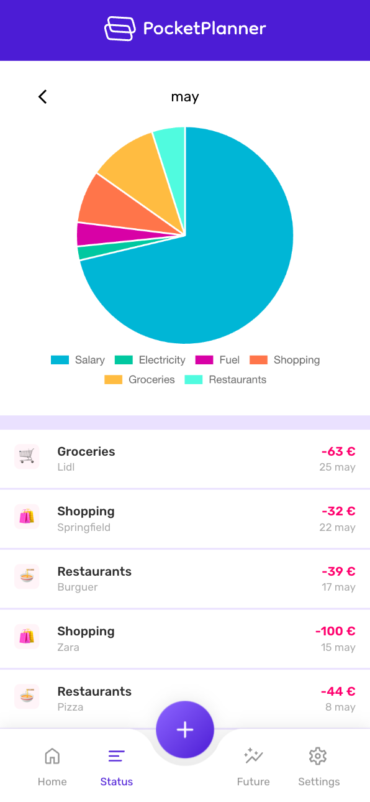
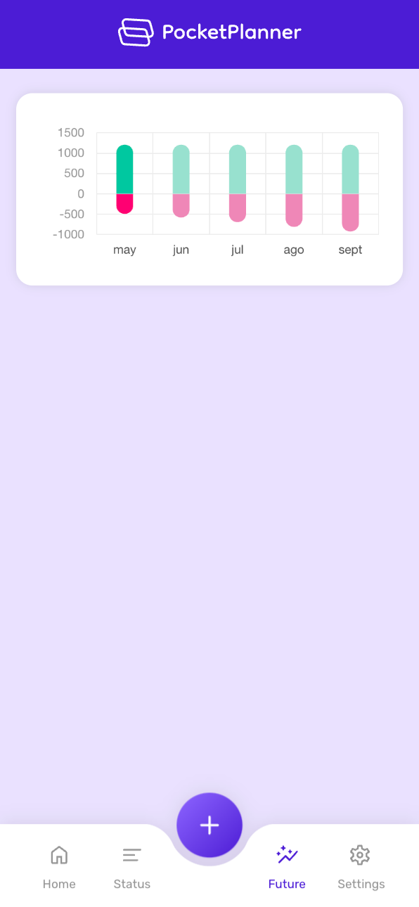
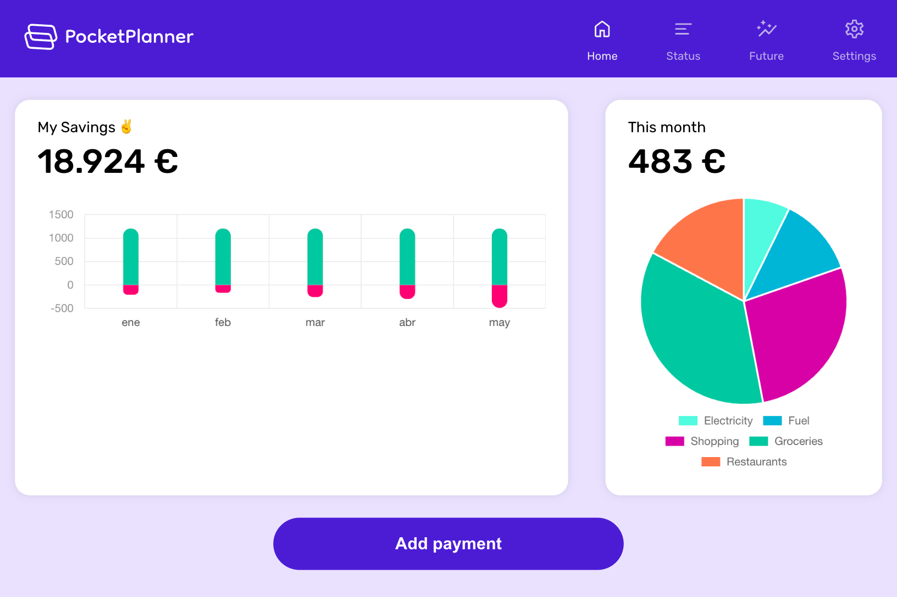
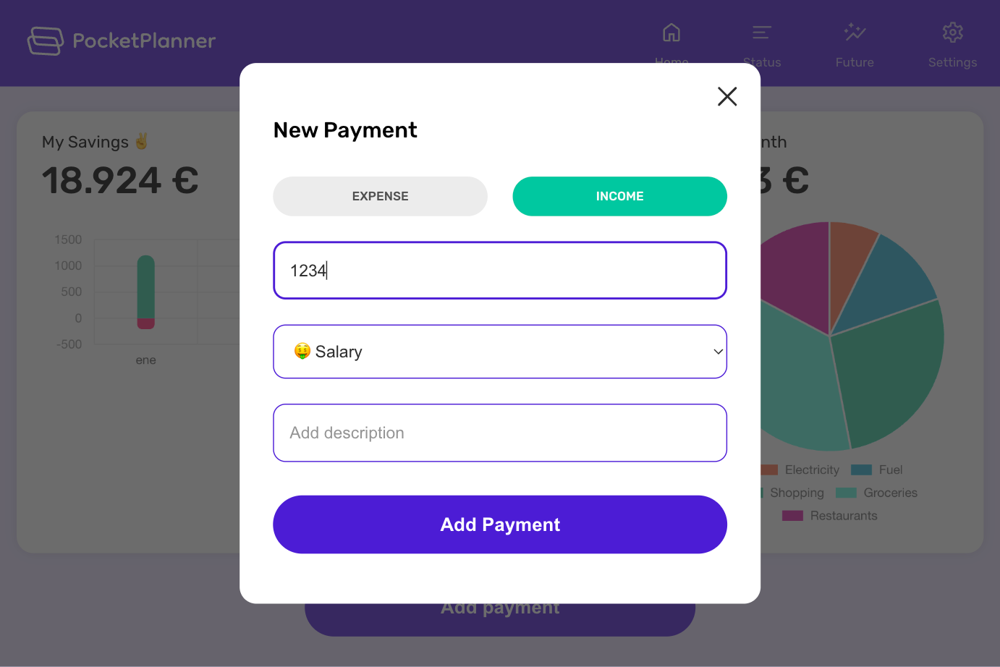
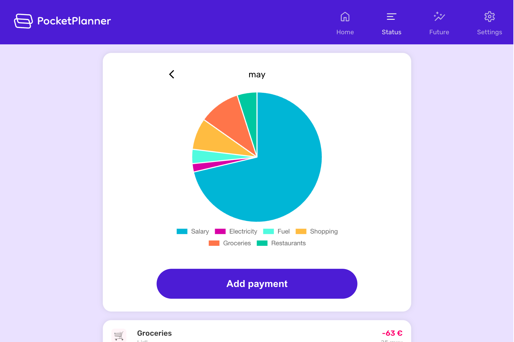
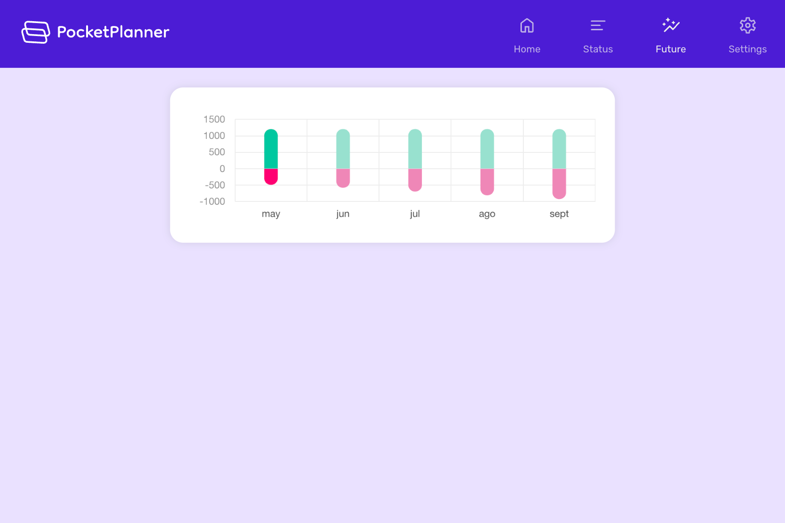

 

Fictional finance APP using Vue 3 and Typescript. All data is persisted in the Client using IndexedDB & LocalStorage

[LIVE DEMO](https://pocket-planner.netlify.app/)

***

## Features

- 💰 Keep track of your current savings
- 🆕 Add new income / expenses
- 📊 Review your historic balances
- 💸 Get detailed monthly info of your expenses
- 🔮 View the future with predictions based on your last income/expenses
- 📱 Responsive design

## Screenshots

    
    
    
    

    
    
    
    

## Dependencies

- Vue 3
- Vue-router (SPA routing)
- Sass (Css extension)
- Pinia (State manager)
- Dexie (IndexedDB wrapper)
- Chart.js (Charts rendering)
- Awesome-toast-component (Toast)
- Simple-statistics (Linear regression calculation for predictions)

## Dev Dependencies

- Vite (Tooling)
- Eslint (Code style & syntax errors)
- Vitest, test-utils, jsdom, c8 (Unit testing & coverage)
- Cypress (e2e testing)

## Possible improvements

- Allow current savings edit
- Allow to edit payments
- Add more categories
- Allow to add / edit categories
